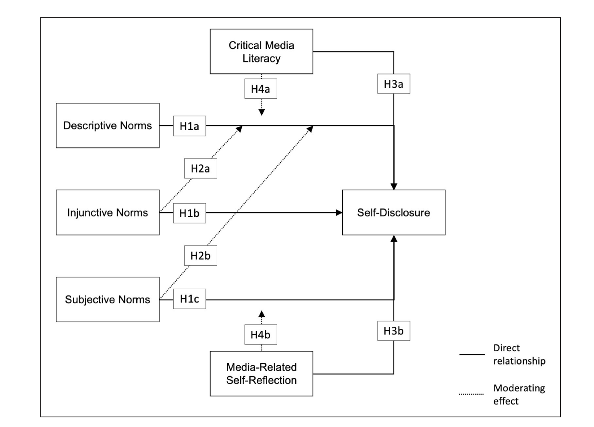

# From Topic to Research Question

## Starting with a topic

A thesis begins with a **topic of interest**, a broad area within communication science that you want to explore. I offer research themes within my expertise. Working within my themes ensures your project is relevant and that you benefit fully from my expertise. My key research areas include:

1. Privacy and Self-Disclosure Dynamics in various Online Environments
2. Social Norms and Social Influence on Social Media
3. Digital Literacy (incl. e.g., Privacy Literacy, Algorithm Literacy, and AI literacy)

Beyond those core topics, I am also willing to supervise topics related to the following areas:

4. Consequences of using Generative AI for Individuals and Society
5. Social Media Use Effects on Individual Well-Being

To gain a better understanding of my research, have a look at my [publications](https://www.philippmasur.de/publications). 

If you propose your own topic, make sure it is:

- **Interesting and feasible** within the timeframe
- **Anchored in existing literature** (you must be able to find a research gap)
- **Researchable** with data you can realistically collect
- Something I can guide — it should fall within my research interests

## Identifying the research gap

A good research question emerges from a **gap in the literature**. After reading the relevant literature in your area, ask yourself:

- What do we know already?
- What is still unclear, inconsistent, or unexplored?
- Why does this gap matter — theoretically and/or for society?

The gap is your justification for doing the study. It should be clearly articulated in your Introduction and elaborated in your Theory chapter.

## Formulating the research question

A good research question is:

- **Specific** — it names the constructs/variables you are interested in
- **Researchable** — it can be answered with empirical data you can collect
- **Theoretically grounded** — it follows from a gap in existing knowledge
- **Focused** — one central question, not multiple questions combined

::: {.callout-tip}
## Common mistake: too broad
"What is the role of social media in society?" is too broad. A better version: "To what extent does exposure to ideologically congruent social media content predict political polarization among Dutch adults?"
:::

In **quantitative, confirmatory research**, the main RQ is typically followed by **hypotheses** that predict specific relationships. These are derived from existing theory.

In **qualitative research** (e.g., grounded theory, thematic analysis) or **exploratory, quantitative research**, the main RQ is usually followed by **sub-questions** that guide your data collection and analysis.

## Hypotheses

A hypothesis proposes a specific, testable relationship between variables. Good hypotheses:

- Propose **one effect** or **relationship** (not multiple effects/relations in one statement)
- Follow **logically** from the theoretical argument
- Are supported by theory and/or **3–5 previous studies** pointing in the same direction
- Use **consistent terminology** with the theory section, conceptual model, and method section that further aligns with the existing terminology in the field

Example: *"H1: Higher exposure to health misinformation on social media will be positively associated with vaccine hesitancy."*

::: {.callout-important}
## Common problem: Non-falsifiable hypotheses
Hypotheses must be falsifiable, i.e., it should be possible that the data does not support them. For example, a hypothesis like this *"Exposure to health misinformation has an effect on vaccine hesitancy"* is almost not falsifiable as it doesn't specify a direction and thus any found effect would support it. 
:::

::: {.callout-important}
## Moderation and mediation in separate hypotheses
Main effects and moderation/mediation effects must be stated in separate hypotheses. Do not combine them.
:::

## Sub-questions (qualitative research)

In qualitative projects, the main RQ is broken down into **sub-questions** that:

- Follow logically from the main RQ
- Address specific aspects or steps of your research
- Are likewise grounded in 3–5 previous studies
- Are formulated distinctively (each addresses a clearly different focus)

Each sub-question ends with a **single question mark** — a common mistake is combining multiple questions before one question mark.

## The conceptual model

For quantitative research, your Theory chapter ends with a **conceptual model** — a visual diagram that maps out the constructs and their hypothesized relationships. Every variable mentioned in your hypotheses must appear in the model. Every variable in the model must appear in your hypotheses and method section.

Use consistent terminology throughout: the same construct should have the same name in the introduction, theory, conceptual model, method, and results.

**Example conceptual model:**

{fig-align="center" width="80%"}

*Source: Masur, P. K., Bazarova, N. N., & DiFranzo, D. (2023). The impact of what others do, approve of, and expect you to do: An in-depth analysis of social norms and self-disclosure on social media. *Social Media + Society*, 9*(1), 1–14. [https://doi.org/10.1177/20563051231156401](https://doi.org/10.1177/20563051231156401)*
