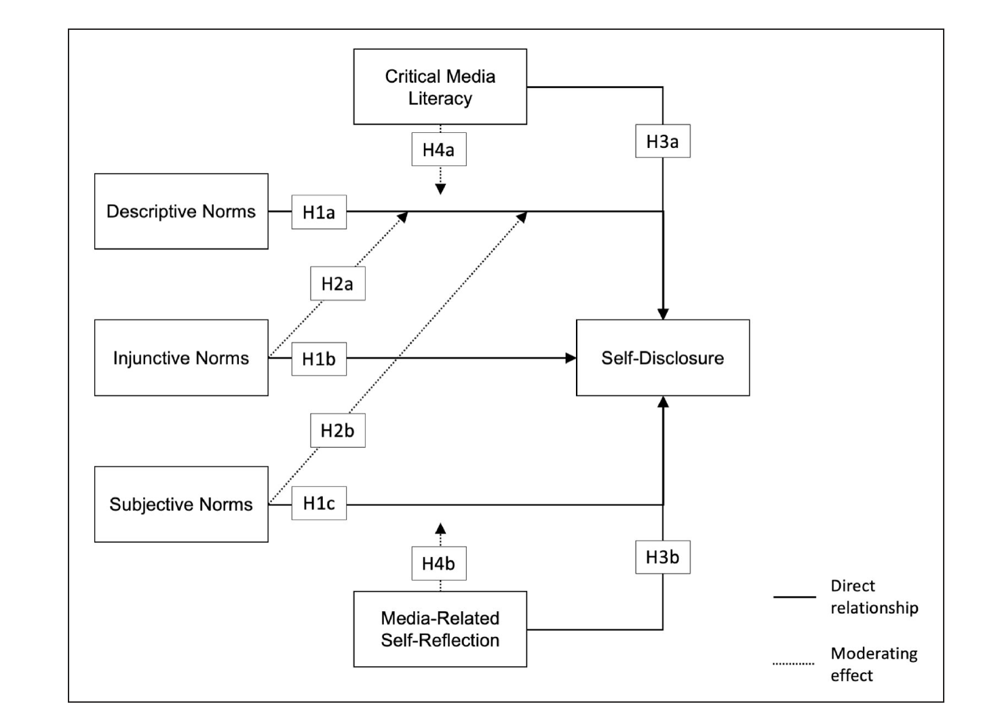

# From Topic to Research Question

## Starting with a topic

A thesis begins with a **topic of interest**, a broad area within communication science that you want to explore. I offer research themes within my expertise. Working within my themes ensures your project is relevant and that you benefit fully from my expertise. My key research areas include:

1. Privacy and Self-Disclosure Dynamics in various Online Environments
2. Social Norms and Social Influence on Social Media
3. Digital Literacy (incl. e.g., Privacy Literacy, Algorithm Literacy, and AI literacy)

Beyond those core topics, I am also willing to supervise topics related to the following areas:

4. Consequences of using Generative AI for Individuals and Society
5. Social Media Use Effects on Individual Well-Being

To gain a better understanding of my research, have a look at my [publications](https://www.philippmasur.de/publications). 

If you propose your own topic, make sure it is:

- **Interesting and feasible** within the timeframe
- **Anchored in existing literature** (you must be able to find a research gap)
- **Researchable** with data you can realistically collect
- Something I can guide — it should fall within my research interests

## Identifying the research gap

A good research question emerges from a **gap in the literature**. After reading the relevant literature in your area, ask yourself:

- What do we know already?
- What is still unclear, inconsistent, or unexplored?
- Why does this gap matter — theoretically and/or for society?

The gap is your justification for doing the study. It should be clearly articulated in your Introduction and elaborated in your Theory chapter.

## Formulating the research question

A good research question is:

- **Specific** — it names the constructs/variables you are interested in
- **Researchable** — it can be answered with empirical data you can collect
- **Theoretically grounded** — it follows from a gap in existing knowledge
- **Focused** — one central question, not multiple questions combined

::: {.callout-tip}
## Common mistake: too broad
"What is the role of social media in society?" is too broad. A better version: "To what extent does exposure to ideologically congruent social media content predict political polarization among Dutch adults?"
:::

### RQ wording conventions

The phrasing of your RQ signals what kind of study you are doing. Use the following as a guide:

| Phrasing | Use when… | Example |
|---|---|---|
| *"To what extent does X affect/predict Y?"* | Quantitative, confirmatory; you expect an effect and want to measure its size | *"To what extent does social media use predict feelings of loneliness among adolescents?"* |
| *"What is the relationship between X and Y?"* | Quantitative, exploratory or correlational; you are uncertain about direction | *"What is the relationship between algorithmic awareness and news consumption diversity?"* |
| *"Under what conditions does X affect Y?"* | Quantitative, moderation focus; you expect the effect to vary | *"Under what conditions does peer disclosure exposure increase users' own disclosure intentions?"* |
| *"How does X influence/shape Y?"* | Qualitative or process-oriented; you want to understand mechanisms, not measure effect sizes | *"How does privacy concern shape self-disclosure decisions in online health communities?"* |
| *"What are the…?"* | Qualitative, exploratory; you are mapping a phenomenon rather than testing a relationship | *"What are users' experiences with algorithmic content curation on TikTok?"* |

Avoid *"Does X affect Y?"* — it invites a yes/no answer and implies a binary rather than a magnitude question. Avoid *"Why does X affect Y?"* unless your design can actually answer causal questions (e.g., an experiment with process measures).

In **quantitative, confirmatory research**, the main RQ is typically followed by **hypotheses** that predict specific relationships. These are derived from existing theory.

In **qualitative research** (e.g., grounded theory, thematic analysis) or **exploratory, quantitative research**, the main RQ is usually followed by **sub-questions** that guide your data collection and analysis.

## Hypotheses

A hypothesis proposes a specific, testable relationship between variables. Good hypotheses:

- Propose **one effect** or **relationship** (not multiple effects/relations in one statement)
- Follow **logically** from the theoretical argument
- Are supported by theory and/or **3–5 previous studies** pointing in the same direction
- Use **consistent terminology** with the theory section, conceptual model, and method section that further aligns with the existing terminology in the field

Example: *"H1: Higher exposure to health misinformation on social media will be positively associated with vaccine hesitancy."*

More examples from typical research areas in Communication Science:

| Research area | Example hypothesis |
|---|---|
| Privacy & self-disclosure | *"H1: Higher privacy literacy will be negatively associated with self-disclosure depth on social media."* |
| Social norms | *"H2: Exposure to descriptive norms showing high peer disclosure will increase participants' own disclosure intentions."* |
| Moderation | *"H3: The positive effect of peer disclosure exposure on disclosure intentions will be stronger for users with lower privacy concerns."* |
| Mediation | *"H4: Privacy concerns will mediate the negative association between privacy literacy and self-disclosure."* |
| Digital literacy | *"H5: Higher algorithm literacy will be negatively associated with susceptibility to algorithmically curated misinformation."* |
| GenAI use | *"H6: More frequent use of generative AI tools for work tasks will be positively associated with feelings of work-related dependency."* |

::: {.callout-important}
## Common problem: Non-falsifiable hypotheses
Hypotheses must be falsifiable, i.e., it should be possible that the data does not support them. For example, a hypothesis like this *"Exposure to health misinformation has an effect on vaccine hesitancy"* is almost not falsifiable as it doesn't specify a direction and thus any found effect would support it.
:::

::: {.callout-important}
## Common problem: Hypotheses that combine multiple effects
The following hypothesis looks specific but is actually two separate predictions in one statement:

*"Privacy literacy is negatively associated with self-disclosure, and this effect is stronger for women and older users."*

This should be split into three hypotheses: one main effect (H1) and two moderation effects (H2, H3). Main effects and moderation/mediation effects must always be stated in separate hypotheses.
:::

### Directional vs. non-directional hypotheses

A **directional hypothesis** predicts the sign of an effect (*positively*, *negatively*, *stronger*, *weaker*). A **non-directional hypothesis** predicts that a relationship exists without specifying its direction (*"X is associated with Y"*).

**Use a directional hypothesis when:**
- Multiple prior studies point consistently in the same direction
- The theoretical mechanism clearly implies one direction

**Use a non-directional hypothesis (or an RQ) when:**
- Prior evidence is mixed or scarce
- Theory is ambiguous about which direction to expect

| Type | Example |
|---|---|
| Directional | *"H1: Higher privacy literacy will be **negatively** associated with self-disclosure depth."* |
| Non-directional | *"H1: Privacy literacy will be associated with self-disclosure depth."* |
| Research question (no prediction) | *"RQ1: What is the relationship between privacy literacy and self-disclosure depth?"* |

A directional hypothesis is stronger — it is easier to falsify and more informative if supported. But it is only justified when the literature genuinely supports the predicted direction. Do not predict a direction just to appear more certain.

::: {.callout-tip}
## Rule of thumb
If you can cite at least 3 studies that consistently found effects in the same direction, a directional hypothesis is appropriate. If findings are mixed or you have fewer than 3 studies, use a non-directional hypothesis or an RQ instead.
:::

## Sub-questions (qualitative research)

In qualitative projects, the main RQ is broken down into **sub-questions** that:

- Follow logically from the main RQ
- Address specific aspects or steps of your research
- Are likewise grounded in 3–5 previous studies
- Are formulated distinctively (each addresses a clearly different focus)

Each sub-question ends with a **single question mark** — a common mistake is combining multiple questions before one question mark.

## The conceptual model

For quantitative research, your Theory chapter ends with a **conceptual model** — a visual diagram that maps out the constructs and their hypothesized relationships. It appears at the end of the Theory chapter, immediately before (or after) your list of hypotheses. Every variable mentioned in your hypotheses must appear in the model. Every variable in the model must appear in your hypotheses and method section.

Use consistent terminology throughout: the same construct should have the same name in the introduction, theory, conceptual model, method, and results.

### Shape conventions

| Shape | Meaning |
|---|---|
| **Rectangle** | Manifest (observed) variable — measured directly with a single item or scale score |
| **Oval / ellipse** | Latent variable — an unobserved construct measured indirectly through multiple indicators (common in SEM/CFA) |

Most MA theses use rectangles throughout. Use ovals only if you are explicitly modeling latent variables in a CFA or SEM framework.

### What to include

- **Boxes/ovals** represent constructs (independent, dependent, mediating, moderating variables)
- **Arrows** represent hypothesized relationships — label each arrow with its hypothesis number (H1, H2, …)
- **Control variables** may be included but are often omitted to keep the model readable; if omitted, note this in the figure caption
- **Do not include** your sample, measures, or analytical method — the conceptual model shows theoretical relationships, not your procedure

### Arrow conventions

| Relationship | How to draw it |
|---|---|
| Direct effect (X → Y) | Single-headed arrow from X to Y |
| Mediation (X → M → Y) | Arrow from X to mediator M, arrow from M to Y; often also a direct arrow from X to Y |
| Moderation (Z moderates X → Y) | Arrow from Z pointing to the arrow between X and Y (drawn as a crossing or intersecting arrow) |

### Complexity

A good conceptual model is readable at a glance. As a rule of thumb:

- **3–7 constructs** is typical for an MA thesis
- If your model has more than 8 constructs or arrows that cross repeatedly, consider whether every element is truly necessary
- Separate models for separate research questions are preferable to one overloaded diagram

### Tools

You can draw your model in PowerPoint, Keynote, draw.io, or Lucidchart. Export as PNG or PDF and insert it into your Quarto/Word document. Avoid hand-drawn or screenshot-from-SPSS diagrams.

**Example conceptual model:**

{fig-align="center" width="80%"}

*Source: Masur, P. K., Bazarova, N. N., & DiFranzo, D. (2023). The impact of what others do, approve of, and expect you to do: An in-depth analysis of social norms and self-disclosure on social media. *Social Media + Society*, 9*(1), 1–14. [https://doi.org/10.1177/20563051231156401](https://doi.org/10.1177/20563051231156401)*
